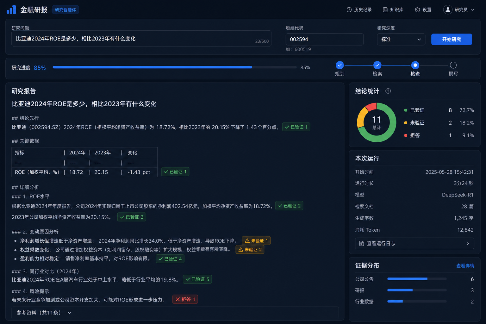
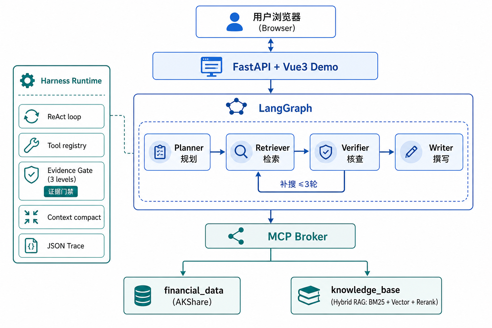

<div align="center">

# 📊 金融研报 Agent

[](https://github.com/Zhengxinhua-starism/finance-research-agent)
[](https://www.python.org/downloads/)
[](docker-compose.yml)
[](web/)

> 🤖 面向 A 股的**研究型 Agent**：输入一个研究问题，自动拉取财务数据、检索知识库、核查证据，输出每条结论带 **✅已验证 / ⚠️未验证 / ❌拒答** 标注的研报。

[**产品预览**](#-产品预览) · [**功能特性**](#-功能特性) · [**架构一览**](#-架构一览) · [**快速开始**](#-快速开始) · [**输出示例**](#-输出示例) · [**文档中心**](#-文档中心)

</div>

> ⚠️ **定位**：信息整理与证据核查工具，**不是**投资建议。输出「事实 + 证据」，不是「买入 / 卖出」。

---

## 🖥️ 产品预览

<p align="center">
  
</p>

<p align="center">
  <sub>启动 <code>python main.py --api</code> 后访问 <code>http://localhost:8010/</code>（端口见 <code>.env</code> 的 <code>API_PORT</code>）</sub><br>
  <sub>上图为示意；建议替换为本地跑题后的真实截图，保存为 <code>docs/images/demo-ui.png</code></sub>
</p>

---

## ✨ 功能特性

| 能力 | 覆盖内容 |
|------|----------|
| 证据标注研报 | 每条结论三级标注：✅ 已验证 / ⚠️ 未验证 / ❌ 拒答；结论统计、Trace 侧栏 |
| 四 Agent 协作 | Planner 规划 → Retriever 检索 → Verifier 核查 → Writer 撰写；证据不足自动补搜（≤3 轮） |
| 三级证据门禁 | 来源存在 → 披露时点合规（防前视）→ 口径一致 → 数字比对（比率/增速分档容差） |
| 混合 RAG | BM25 + 向量 RRF 融合 + CrossEncoder 精排；行业框架 / 分析方法 / 风险规则检索 |
| 金融数据工具 | 13 个 MCP 语义工具（AKShare）：利润表、资产负债、现金流、杜邦、风险快照、新闻等 |
| Web + CLI + API | Vue3 演示前端、SSE 进度流、CLI 调试、`/api/research` 与 OpenAPI |
| 可观测性 | 全链路 JSON Trace：LLM / 工具 / 门禁事件，可定位「哪句被拦、为什么」 |
| 自动化评测 | 9 道测试题 + LLM-as-Judge 五维评分 + `pytest` 门禁单测 |

> 编排用 LangGraph，运行时用自建 Harness（ReAct、压缩、门禁、Trace）。设计权衡见 [`docs/architecture.md`](docs/architecture.md)。

### 技术栈

| 类型 | 选用 |
|------|------|
| 编排 | LangGraph StateGraph |
| 运行时 | 自建 Harness（`harness/`） |
| LLM | DeepSeek（chat + reasoner，两层路由） |
| 工具协议 | MCP JSON-RPC 语义（进程内 Broker） |
| 行情 / 财报 | AKShare |
| 向量检索 | Chroma + BM25 + RRF + CrossEncoder |
| 服务 | FastAPI + SSE；Redis 可选（无则降级） |
| 前端 | Vue 3 + Vite |

---

## 🏗 架构一览

<p align="center">
  
</p>

```
FastAPI + Vue3
      │
LangGraph：Planner → Retriever → Verifier → Writer
                              └─ 证据不足 ─→ Retriever（补搜 ≤3 轮）
      │
MCP Broker → financial_data (AKShare) + knowledge_base (Hybrid RAG)
      │
Harness：ReAct · 工具注册/超时 · 证据门禁 · 上下文压缩 · JSON Trace
```

---

## 🚀 快速开始

### 克隆与安装

```bash
git clone https://github.com/Zhengxinhua-starism/finance-research-agent.git
cd finance-research-agent

python -m venv .venv
# Windows: .venv\Scripts\Activate.ps1
pip install torch --index-url https://download.pytorch.org/whl/cpu
pip install -r requirements.txt

cp .env.example .env
# 编辑 .env，填入 DEEPSEEK_API_KEY
```

### 初始化知识库（首次必须，约 3 分钟）

```bash
python main.py --prepare-data
```

会下载 embedding / reranker 模型并构建 Chroma 索引。

### 方式一：CLI 调试（推荐开发时用）

```bash
python main.py -q "比亚迪2024年毛利率为什么下降" -c 002594
```

### 方式二：Web 演示

```bash
cd web && npm install && npm run build && cd ..
python main.py --api
# 浏览器打开 http://localhost:8010/
# 前端热更新：cd web && npm run dev → http://localhost:5173
```

### 方式三：Docker

```bash
cp .env.example .env   # 填入 DEEPSEEK_API_KEY
docker-compose up -d --build
docker-compose exec api python -m rag.prepare_data   # 首次
```

### 环境要求

| 项 | 说明 |
|----|------|
| Python | 3.11 / 3.12（3.13+ 上 chromadb 尚无稳定 wheel） |
| API Key | [DeepSeek](https://platform.deepseek.com/api_keys) |
| Redis | 可选；未启动时自动降级内存 / 磁盘 |
| Node.js | Web 构建需要；仅 CLI 可跳过 |

> **Windows**：项目路径过长时，venv 可建在短路径（如 `D:\venvs\fra`），避免 torch 安装 WinError 206。

---

## 📋 输出示例

研报正文每条结论带证据等级，门禁拦截的编造数字不会静默进入正文：

```
## 核心结论

- ✅ 2024 年 ROE 约 21.7%（期末摊薄口径），较上年下降约 8 个百分点
- ✅ 杜邦拆解：净利率下降是 ROE 走弱的主因
- ⚠️ 毛利率变动与成本结构相关，部分分项来源为新闻，数字未过门禁
- ❌ 无法判断：缺少截至基准日的分部收入明细，拒答不编造

## 结论统计
已验证 8 · 未验证 2 · 拒答 1
```

Trace 片段（`traces/run_*.json`）：

```json
{
  "event_type": "gate_check",
  "output_summary": "number_mismatch: 数字与来源不一致",
  "success": false
}
```

---

## 📈 评测

`eval_20260814_115957`（压缩修复后全量 9 题）：

| 维度 | 得分 |
|------|------|
| 事实准确性 | 0.964 |
| 归因质量 | 0.833 |
| 拒答校准 | 1.000 |
| 证据覆盖 | 0.895 |
| 检索效率 | 0.889 |
| **加权总分** | **0.923** |

通过率 **9/9**（阈值 0.60）。分数来自 LLM-as-Judge，Writer / UI 改动后宜重跑。

```bash
python main.py --eval              # 全量 9 题
python main.py --eval --cases 1,2,8
pytest                             # 门禁等纯逻辑单测
```

明细：[`eval/results/eval_20260814_115957.md`](eval/results/eval_20260814_115957.md)

---

## 🌐 API 接口

| 方法 | 路径 | 说明 |
|------|------|------|
| POST | `/api/research` | 发起研究；`async_mode=true` 立即返回 `session_id` |
| GET | `/api/session/{id}` | 查询进度与结果 |
| GET | `/api/session/{id}/events` | SSE：`progress` / `done` |
| GET | `/api/trace/{run_id}` | 完整 trace |
| POST | `/api/eval` | 运行自动化评测 |
| GET | `/api/health` | Redis / Chroma / LLM / MCP 健康检查 |
| GET | `/docs` | OpenAPI 文档 |

```bash
curl -X POST http://localhost:8010/api/research \
  -H "Content-Type: application/json" \
  -d '{"question":"比亚迪2024年ROE是多少","company_ticker":"002594","as_of_date":"2025-06-30"}'
```

---

## 📚 文档中心

| 文档 | 内容 |
|------|------|
| [`docs/architecture.md`](docs/architecture.md) | 架构详解：Harness vs LangGraph、门禁、RRF、压缩策略 |
| [`docs/data_coverage.md`](docs/data_coverage.md) | 数据覆盖度：10 个分析维度与 AKShare 能力边界 |
| [`docs/interview_qa.md`](docs/interview_qa.md) | 面试问答与项目话术 |
| [`eval/failure_log.md`](eval/failure_log.md) | 真实失败案例与校准记录 |
| [`cursor_prompt.md`](cursor_prompt.md) | 项目原始需求与实现对照 |

### 项目结构（节选）

```
finance_research_agent/
├── harness/       自建运行时：门禁、ReAct、压缩、Trace
├── agents/        Planner / Retriever / Verifier / Writer
├── graph/         LangGraph 编排
├── rag/           混合检索与建库
├── mcp_servers/   MCP Broker + 数据 / 知识库服务
├── api/           FastAPI
├── web/           Vue3 演示前端
├── eval/          9 道评测题 + Judge
└── traces/        运行 trace（自动生成）
```

---

## ⚠️ 免责声明

本项目输出的是公开财报数据的整理与核查结果，**不构成任何投资建议**。

数据来源为 AKShare 等公开接口，可能存在延迟或错误；披露日期部分为法定截止日估算。投资决策请以上市公司正式披露文件为准。

---

<div align="center">
<sub>参考 README 排版：<a href="https://github.com/ZhuLinsen/daily_stock_analysis">daily_stock_analysis</a></sub>
</div>
